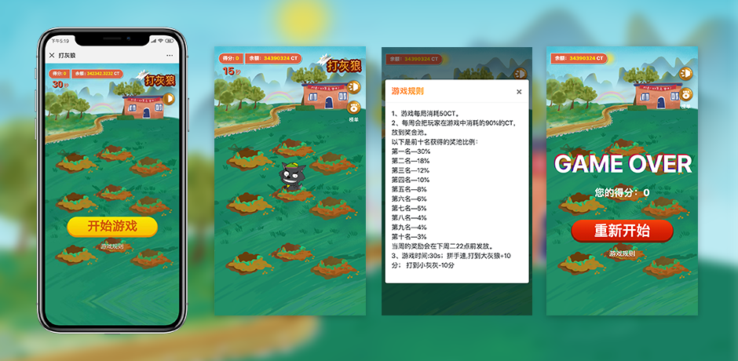

# whack-a-mole打灰狼

#### 介绍

H5打灰狼,适配于手机端。用于网页小游戏消耗积分。

#### 传输接口

#### 接口

#### 软件架构
软件架构思路说明

1.创建画布

	设置背景图
	
	时钟、按钮等

2.创建狼

	生成一个狼——是生成小灰灰还是灰太狼
	
	随机一个位置——判断该位置是否有狼
	
	无,则把狼放到该位置
	
3.狼动画

	狼上升
	
	定时器更改图片路径实现动画
	
	判断是否到了最上面的位置
	
	是则下降
	
	下降到最底部把狼删掉——清空该清空的定时器
	
4.打狼

	不管原先狼的动画跑到第几帧,
	
	把帧数设置成打狼的动画
	
	打灰太狼加分
	
	打小灰灰减分
	
5.游戏结束

	把页面的数据还原到初始状态

#### 参与贡献

## 日志
-----
#### 2019-07-20

- 修复全尺寸手机适配
- 去除弹出图片有站位白边问题。

#### 2019-07-16

- 创建底层文件